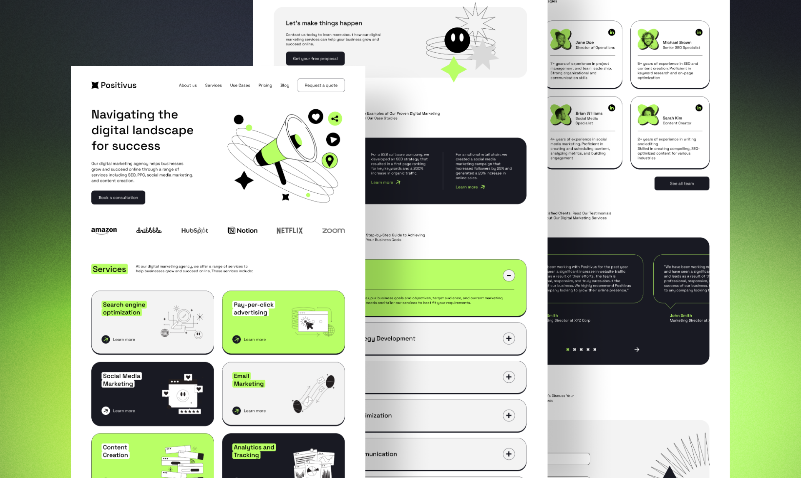

# Positivus

> A landing page for a digital marketing agency.

### 🛠️ Built Using

[![Vue][Vue.js]][Vue-url] [![Nuxt][Nuxt.js]][Nuxt-url] [![Storyblok][Storyblok]][Storyblok-url] [![Tailwind][Tailwindcss]][Tailwindcss-url] [![Sass][Sass]][Sass-url] [![Swiper][Swiper.js]][Swiper-url] [![GSAP][GSAP]][GSAP-url]

## Purpose

I was wanting more practice with Vue/Nuxt while also using a cms. This design also allowed for me to use Swiper and GSAP in the context of a Vue app.

## Attribution

Design by [Olga Averchenko](https://olgaaverchenko.gumroad.com/)

[Nuxt.js]: https://img.shields.io/badge/nuxt.js-00DC82?style=for-the-badge&logo=nuxtdotjs&logoColor=00DC82&color=black
[Nuxt-url]: https://nuxt.com/
[Vue.js]: https://img.shields.io/badge/Vue.js-000000?style=for-the-badge&logo=vuedotjs&logoColor=4FC08D
[Vue-url]: https://vuejs.org/
[Tailwindcss]: https://img.shields.io/badge/tailwindcss-06B6D4?style=for-the-badge&logo=tailwindcss&logoColor=06B6D4&color=black
[Tailwindcss-url]: https://tailwindcss.com/
[Sass]: https://img.shields.io/badge/sass-CC6699?style=for-the-badge&logo=sass&logoColor=CC6699&color=black
[Sass-url]: https://sass-lang.com/
[Swiper.js]: https://img.shields.io/badge/swiper-6332F6?style=for-the-badge&logo=swiper&logoColor=6332F6&color=black
[Swiper-url]: https://swiperjs.com/
[GSAP]: https://img.shields.io/badge/gsap-88CE02?style=for-the-badge&logo=greensock&logoColor=88CE02&color=black
[GSAP-url]: https://gsap.com/
[Storyblok]: https://img.shields.io/badge/storyblok-09B3AF?style=for-the-badge&logo=storyblok&logoColor=09B3AF&color=black
[Storyblok-url]: https://www.storyblok.com/
